# MorphicUI — Architecture and Complete Lifecycle

> **CURRENT — code-verified 2026-08-26.** This document is the authority for the current MorphicUI
> prompt, request, streaming, parsing, rendering, interaction, observability, and distribution
> lifecycles. For parser internals, see [How the Renderer Works](how-the-renderer-works.md). For the
> wider design and DSL, see the [Master Blueprint](MORPHIC_UI_BLUEPRINT.md).

## Scope

This document describes the application as implemented in `morphic_ui/`. It distinguishes the
currently implemented runtime from the proposed Docker distribution path.

## 1. System context

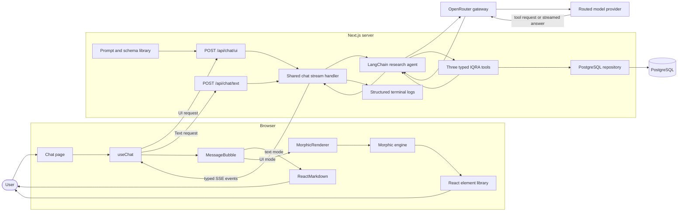

The browser never receives the OpenRouter API key or constructs the system prompt. Model access and
prompt attachment remain server-side.

## 2. Prompt creation and attachment lifecycle

### 2.1 Prompt construction flow

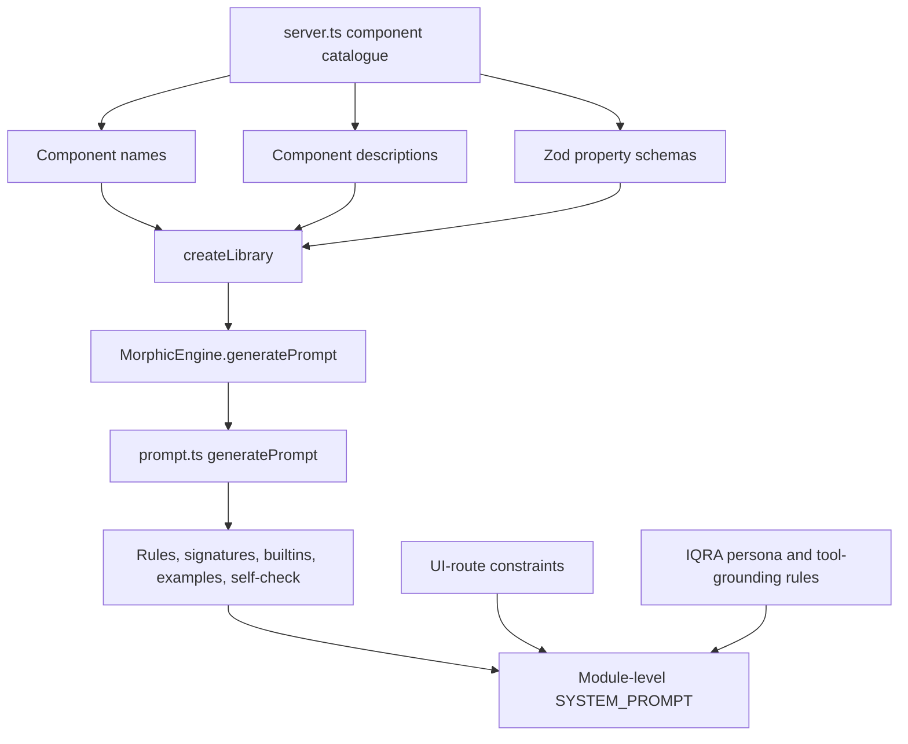

The UI prompt contains:

1. The MorphicUI role and output contract.
2. MorphicLang syntax rules.
3. Component signatures generated from the server-side Zod schemas.
4. Builtin operation documentation.
5. `@Each` scope and filtering constraints.
6. Streaming-order rules.
7. Worked examples.
8. A final self-check.
9. Additional route-level rules for Markdown fallback, one-line statements, and compact example data.
10. IQRA tool-use, source attribution, as-of-date, and missing-data rules.

### 2.2 When construction and attachment happen

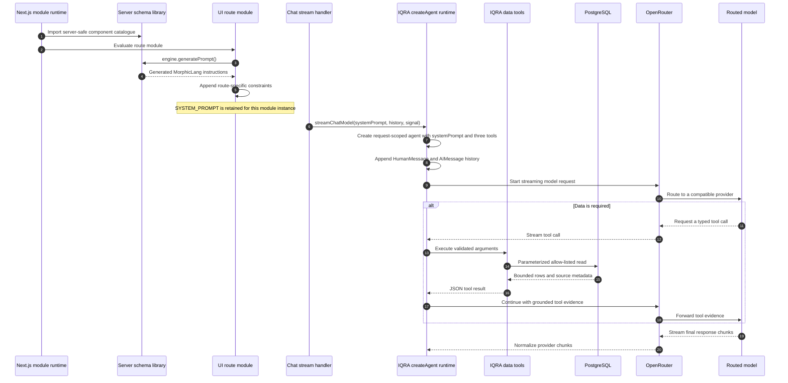

The prompt string is generated once per route-module instance, but it is attached and transmitted on
every model request. A development hot reload, process restart, deployment, or serverless cold start
can create a new module instance.

The text route does not use the generated MorphicLang prompt. It attaches its own short Markdown
assistant instruction.

## 3. Complete chat request sequence

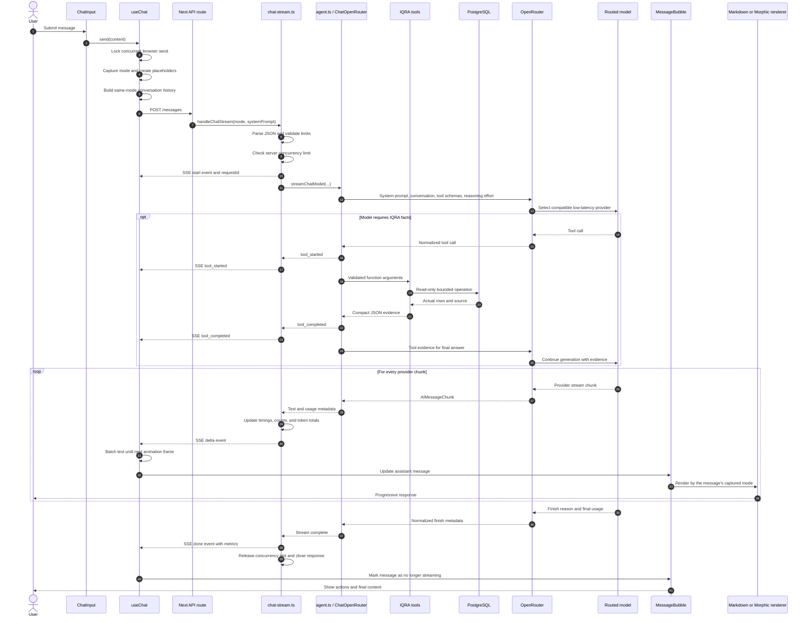

### Request boundaries

| Boundary             | Current rule                                                          |
| -------------------- | --------------------------------------------------------------------- |
| Browser send         | A synchronous in-flight lock prevents duplicate sends.                |
| Conversation history | Only messages from the request's captured mode are included.          |
| Message count        | 1–30 messages.                                                       |
| Message size         | 1–16,000 characters per message.                                     |
| Total history        | At most 100,000 characters.                                           |
| Server concurrency   | Configured by`CHAT_MAX_CONCURRENT_REQUESTS`; default 4 per process. |
| Generation timeout   | Configured by`CHAT_TIMEOUT_MS`; default 180 seconds.                |
| Model retry          | `ChatOpenRouter` is configured for at most 2 retries.               |

### 3.1 PostgreSQL read boundary

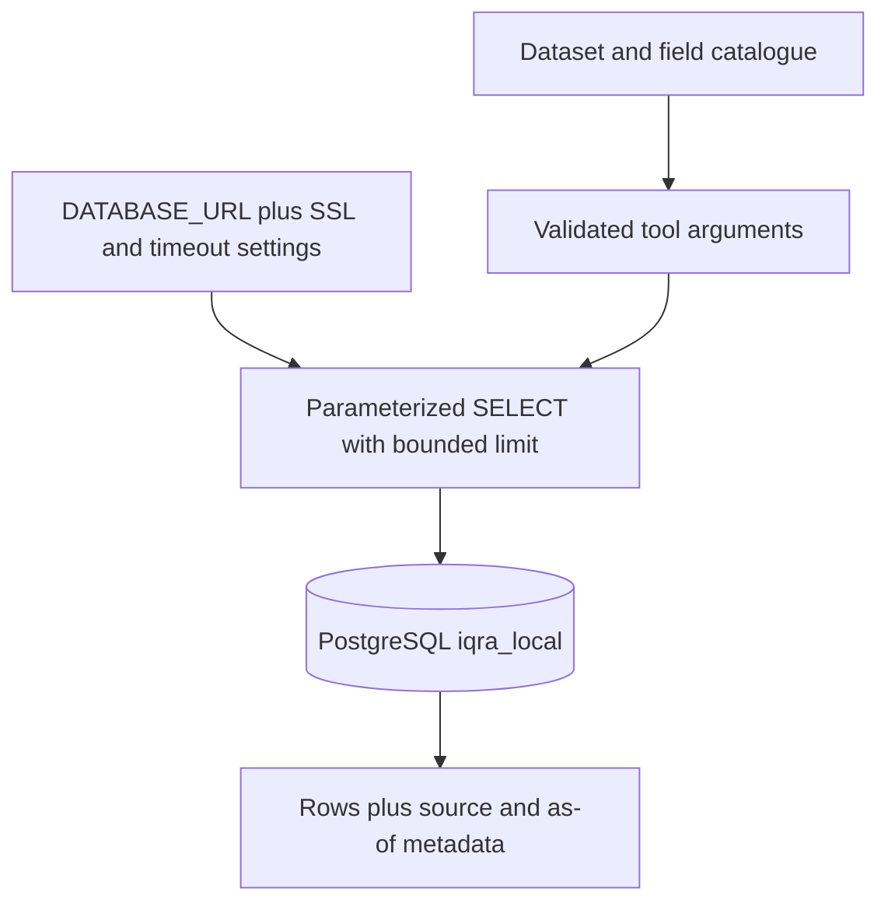

PostgreSQL is the only runtime data source. `DATABASE_URL` is required at startup; there is no local
file parser or automatic fallback. The catalogue rejects unknown tables and fields before SQL is
built, values remain parameterized, and every read has a fixed row ceiling. See
[Configure the PostgreSQL database](iqra-data-sources.md).

## 4. Typed streaming protocol

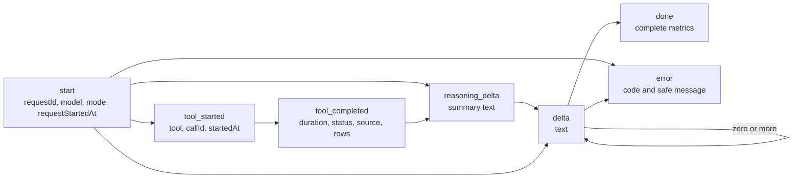

Events are sent as Server-Sent Events using `data: JSON` records. Provider failures are carried as
typed `error` events rather than being appended to generated Markdown or MorphicLang.

## 5. UI versus text rendering branch

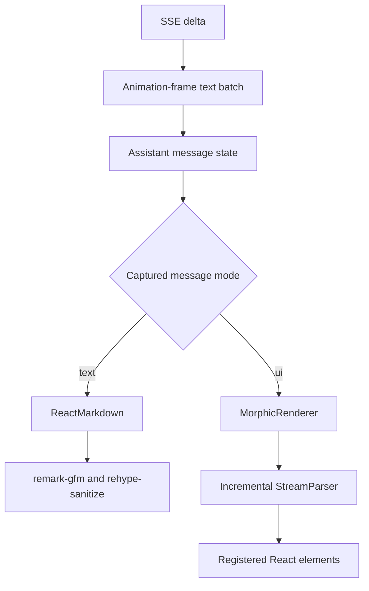

Mode is stored on each message. Changing the input toggle affects the next request only; it does not
reinterpret older responses.

## 6. MorphicUI incremental parse and render lifecycle

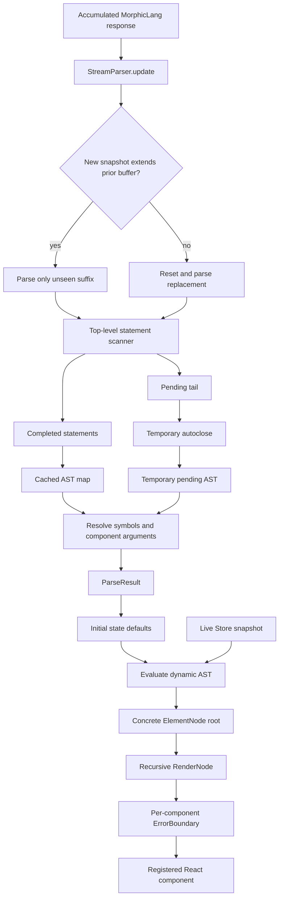

Completed statements are cached. Only the newly appended suffix and current pending tail are reparsed
during normal model streaming. This avoids clearing the parser cache on every provider chunk.

## 7. Local interaction lifecycle

Most generated UI interaction does not require another model request.

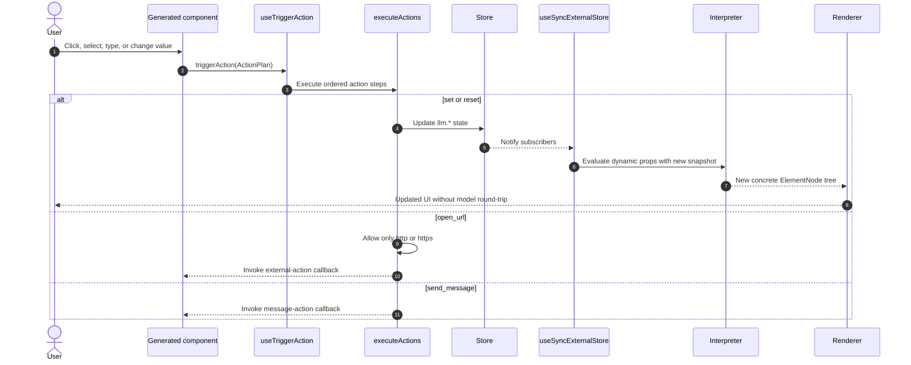

Repeated parser updates do not overwrite a state value already changed by the user. Parsed declarations
only initialize missing `llm.*` keys.

## 8. Failure, timeout, and cancellation lifecycle

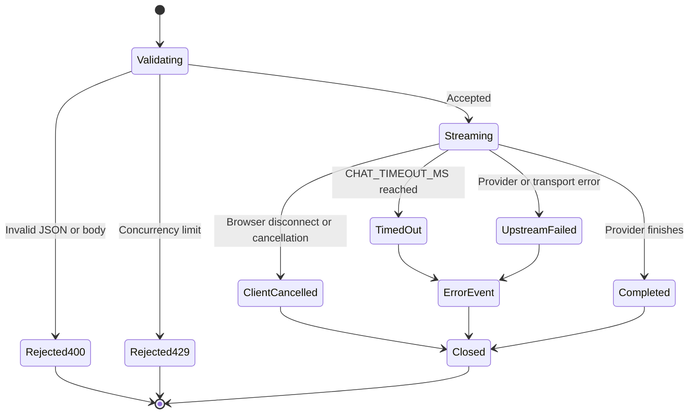

All terminal paths clear the timeout and release the process-local concurrency slot. The browser keeps
already received output and displays a separate error notice when an `error` event arrives.

## 9. Observability timeline

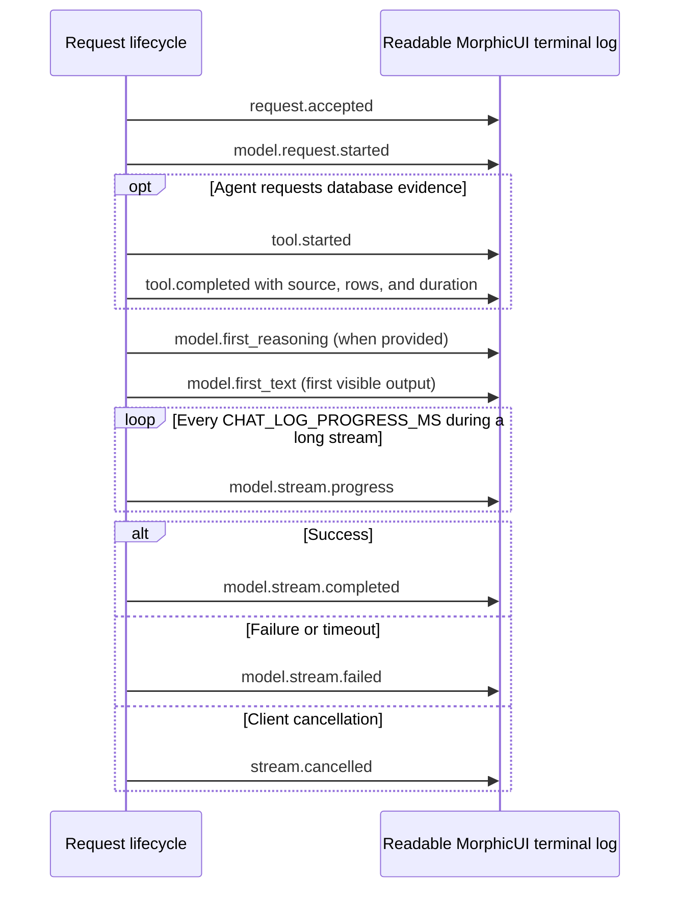

### Metric interpretation

| Metric                                             | Meaning                                                                        |
| -------------------------------------------------- | ------------------------------------------------------------------------------ |
| `model`                                            | Requested model; updated to the served model when the adapter exposes it.       |
| `requestToModelMs`                               | Route entry through validation and stream setup, before the model call starts. |
| `modelSetupMs`                                   | Model-call start until the direct model or agent event stream is constructed.  |
| `timeToFirstChunkMs`                             | Model-call start until the first provider chunk.                               |
| `timeToFirstTextMs`                              | Model-call start until the first non-empty text chunk.                         |
| `timeToFirstReasoningMs`                         | Model-call start until the first reasoning-summary chunk, when available.      |
| `streamOpenToFirstTextMs`                        | Stream construction until first visible text; includes tool-loop time in UI mode. |
| `streamingMs`                                    | Stream construction until completion, including tool-loop time.                |
| `textStreamingMs`                                | First non-empty text until completion.                                         |
| `toolCalls`, `toolFailures`, `totalToolMs`        | Tool count, failures, and combined tool duration; parallel calls may overlap.   |
| `maxChunkGapMs`                                  | Largest pause observed between provider chunks.                                |
| `charsPerSecond`                                 | Output characters divided by the text-streaming duration.                      |
| `inputTokens`, `outputTokens`, `totalTokens` | Accumulated provider usage deltas.                                             |

The default `CHAT_LOG_FORMAT=pretty` groups each request into readable stages and an aligned completion
summary. Every wall-clock timestamp uses `Asia/Kolkata` and is labelled `IST`; structured timestamps
include the explicit `+05:30` offset. Elapsed latency fields such as `totalMs` and `textStreamingMs` use
a monotonic timer, so clock or timezone changes cannot distort them. Set `CHAT_LOG_FORMAT=json` for the
single-line structured records used by log collectors. Both formats contain sizes, timings,
identifiers, and safe error information; neither intentionally logs the API key, system-prompt
contents, or conversation contents.

## 10. Docker distribution lifecycle

> **TARGET — not yet implemented in the repository.** The current repository has no `Dockerfile` and
> `next.config.ts` does not yet enable standalone output.

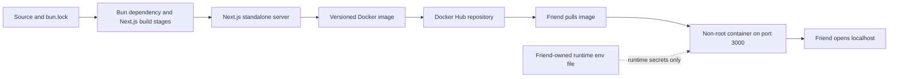

The intended lifecycle is:

1. Enable Next.js `output: "standalone"`.
2. Build dependencies and application in isolated Docker stages.
3. Copy only `public`, `.next/standalone`, and `.next/static` into the runtime image.
4. Push immutable version tags and an optional `latest` tag to Docker Hub.
5. Let each recipient supply their own `OPENROUTER_API_KEY` at container runtime.
6. Never copy `.env.local` into the image or build context.

For a public shared deployment, put a reverse proxy, authentication, and external rate limiting in front
of the container. The current concurrency counter protects one process; it is not a distributed public
rate limiter.

## 11. Lifecycle invariants

- Prompt generation is server-side; prompt attachment occurs immediately before the model call.
- OpenRouter tries the configured fallback models when the requested model has no usable endpoint.
- The generated UI prompt is cached for a module instance but transmitted on every UI request.
- The browser sends conversation messages, never the server system prompt or provider key.
- UI and text histories remain separate.
- Stream errors remain separate from generated content.
- IQRA facts require tool evidence; the model cannot submit raw SQL or select an uncatalogued field.
- One request uses exactly one configured IQRA source and reports that source in tool progress.
- Portfolio analyses use each fund's latest available holdings and return per-fund as-of dates.
- A UI response is parsed incrementally; completed statements are cached.
- Local state interaction normally reevaluates the existing tree without calling the model.
- Every accepted request must release its timeout and concurrency slot on completion, error, or cancel.
- Docker images must receive secrets at runtime, never at image build or publication time.

## 12. Code evidence

| Lifecycle area                                 | Primary implementation                                                           |
| ---------------------------------------------- | -------------------------------------------------------------------------------- |
| Component prompt catalogue                     | `packages/elements/server.ts`                                                  |
| Prompt construction                            | `packages/engine/schema/prompt.ts`                                             |
| UI and text prompt selection                   | `app/api/chat/ui/route.ts`, `app/api/chat/text/route.ts`                     |
| Validation, SSE, cancellation, limits, metrics | `lib/chat-stream.ts`                                                           |
| System-message attachment and OpenRouter call  | `lib/agent.ts`                                                                 |
| Research prompt and database-tool grounding     | `lib/research/prompt.ts`, `lib/research/tools.ts`                              |
| Dataset/field allow-list                        | `lib/research/catalog.ts`                                                      |
| PostgreSQL read adapter                         | `lib/research/data-source.ts`                                                  |
| Entity queries and portfolio calculations      | `lib/research/service.ts`                                                      |
| Browser history and SSE consumption            | `app/hooks/useChat.ts`                                                         |
| Reasoning and tool-progress panel               | `app/components/chat/ReasoningPanel.tsx`                                       |
| Mode-specific rendering                        | `app/components/chat/MessageBubble.tsx`                                        |
| Incremental parsing                            | `packages/engine/parser/stream.ts`                                             |
| Dynamic evaluation and state                   | `packages/engine/runtime/interpreter.ts`, `packages/engine/runtime/state.ts` |
| Recursive React rendering                      | `packages/renderer/MorphicRenderer.tsx`, `packages/renderer/RenderNode.tsx`  |

## Evidence 2026-08-26

- **Environment:** local development and production build.
- **Scope:** prompt construction, OpenRouter-backed agent and direct streaming, typed SSE, PostgreSQL-backed IQRA
  reads, deterministic portfolio analysis, parser/renderer behavior, state preservation, metrics, and
  documented Docker readiness.
- **Observed verification:** TypeScript, ESLint, and the production Next.js build passed after the
  PostgreSQL-only conversion. Earlier renderer/element gates passed 31/31. The focused documentation
  audit is rerun whenever this file changes.
- **Open evidence gap:** the supplied SQL dump has not yet been restored and no private application
  credential is available to this process. Restore `iqra_local`, create `mf_saarthi`, and run
  `bun run test:database` to finish the live PostgreSQL gate.
